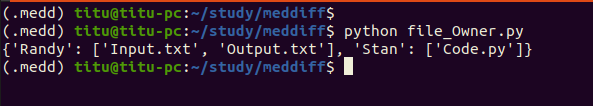
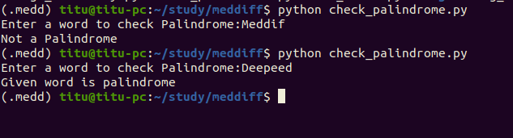
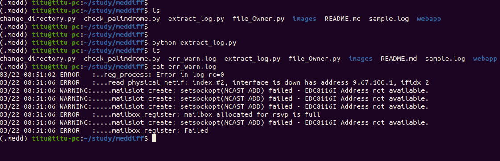
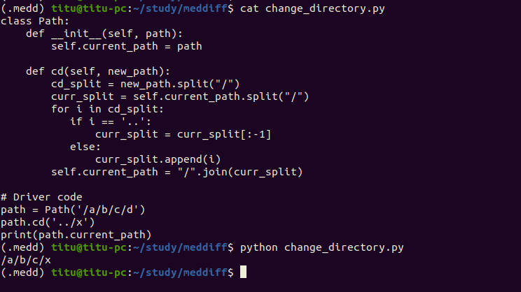

##1. Question
```
Implement a group_by_owners function that:
  - Accepts a dictionary containing the file owner name for each file name.
  - Returns a dictionary containing a list of file names for each owner name, in any order.

For example, for dictionary {'Input.txt': 'Randy', 'Code.py': 'Stan', 'Output.txt': 'Randy'} the group_by_owners function should return {'Randy': ['Input.txt', 'Output.txt'], 'Stan': ['Code.py']}.
```
###Answer:
```Script Name: file_Owner.py```
###Output:


##2. Question
```
Write a function that checks if a given word is a palindrome. Character case should be ignored.
```
###Answer
```Script Name: check_palindrome.py```
###Output


##3. Question
```
Write a function to parse a log file & extract details of Errors & Warnings recorded into a separate file.
```
###Answer
```Script Name: extract_log.py```
###Output


##4. Question
```
Write a function that provides a change directory (cd) function for an abstract file system.

Notes:
Root path is '/'.
Path separator is '/'.
Parent directory is addressable as '..'.
Directory names consist only of English alphabet letters (A-Z and a-z).
The function should support both relative and absolute paths.
The function will not be passed any invalid paths.
Do not use built-in path-related functions.

For example:
path = Path('/a/b/c/d')
path.cd('../x')
print(path.current_path)
Output:
Should display '/a/b/c/x'.
```
### Answer
```buildoutcfg
Script Name: change_directory.py
```
### Output


## 5. Question
```
Design & develop a web application to maintain records of students.
The single the record shall contain the following information: 
| Name | Roll number | Age | Gender |

The application should have the ability to INSERT, DELETE, UPDATE & SEARCH records.
Please Note: this application should not use any DATABASE.
```
###Answer
```
Directory Name: webapp
Please follow instructions in webapp/README.md
```
